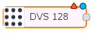

## DevOps
La estructura a utilizar es la que se encuentra detallada [aqui](https://cocheok.github.io/robotics_devops)

## Software

El desarrollo de software consiste tomar las librerias publicadas por [Robotics perception Group](https://github.com/uzh-rpg/rpg_dvs_ros) adaptarlas a los flujos de Node-Red
En el caso del nodo de ROS [dvs_ros_driver](https://github.com/uzh-rpg/rpg_dvs_ros/tree/master/dvs_ros_driver) se crea un nodo de Node-Red bajo la categoria DVS128

Dicha adaptación se realiza utilizando la libreria de NodeJS [rosjs](http://wiki.ros.org/brown_remotelab/Tutorials/Using%20rosjs%20to%20control%20ROS%20from%20Javascript) que es la que realiza la comunicación con el roscore a traves de [rosbridge](http://wiki.ros.org/rosbridge_suite) y manteniendo el prefijo **node-red-** como nombre del proyecto de NodeJS de npm realizado.

## Hardware 
  
El dispositivo utilizado en este proyecto es una cámara DVS128 desarrollada por [IniLabs](http://inilabs.com/support/hardware/dvs128/).
