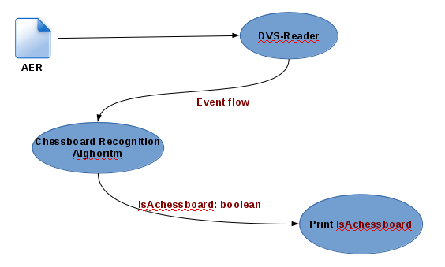
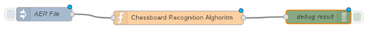
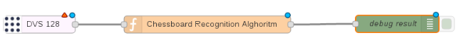

## Demo 1

El software de demostración consiste en el reconocimiento de un tablero de ajedrez dada una grabación. 

La estructura lógica del mismo se compone de:

  - Una base de datos de objetos conocidos en los cuales almacene el flujo de eventos necesarios para el reconocimiento un tablero de ajedrez. 
  - Un nodo de Mock que lo que haga sea leer el archivo AER provisto por la camara DVS 128 que simule la camara conectada.
  - Un nodo de reconocimiento cuya entrada sea el flujo de eventos y su salida un booleano, true en el caso de que lo reconozca.
  - Un nodo que imprima el resultado en la pantalla de debug de Node-Red .
  
Dicha estructura se puede visualizar en el siguiente diagrama:

El flujo inicia cuando se recibe como entrada una grabación de una cámara DVS128 (AER File) en un nodo DVS-Reader que tiene el fin de enviarle el flujo de eventos registrados en la grabación a un nodo llamado Chessboard Recognition Alghoritm, que realiza un algoritmo de reconocimiento de un tablero de ajedrez y retorna un booleano con el valor true en el caso de que lo reconozca. Para ello debemos realizar un flujo de Node-Red tendría la siguiente forma:

El nodo AER File lo que hace es enviar la información del archivo dado en forma serializada simulando ser la cámara DVS128.
El nodo Chessboard Recognition Alghoritm lo que hace es conectarse a un nodo de ros informando los datos que recibe un nodo de ROS que detecta el tablero de ajedrez del flujo de eventos recibidos y luego ni bien lo tiene identificado devuelve true el cual es logueado en la consola de debug que provee la herramienta.

## Demo 2

El software de demostración consiste en el reconocimiento de un tablero de ajedrez con la cámara DVS128.

Si reemplazamos el nodo AER File del Demo1 por un nodo real que tenga los controladores de la cámara DVS128 y conectando la misma al dispositivo en el que se encuentre corriendo el servicio de Node-Red, se puede utilizar el nodo Chessboard Recognition Alghoritm. Siendo el flujo de la siguiente forma:

