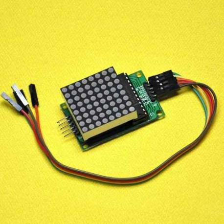
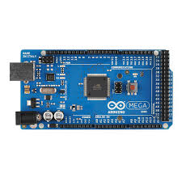

#Calibración

Para la calibración utilizamos el modulo de ros desarrollado por [Robotics and Perception group](https://github.com/uzh-rpg/rpg_dvs_ros.git). La calibración requiere un tablero con una grilla regular de LEDs parpadeando. El nuestro caso utilizamos la grilla **Modulo Max7219 Dot Led Matrix 8x8 Arduino/pic**
 

La misma la controlamos desde un **Arduino MEGA 2560 R3**

Configuramos los siguientes parametros en **dvs_calibration**: 

- **dots_w**: Numero de filas LED

- **dots_h**: Numero de columnas LED

- **dot_distance**: distancia en metros entre los LED en **metros**

- **blinking_time_us**: tiempo de parpadeo en **micro**-segundos

- **blinking_time_tolerance_us**: Es la tolerancia en micro-segundos para contar la transición

- **minimum_transitions_threshold**: Es el número mínimo de transiciones necesarias a considerar en la búsqueda de los LED.

- **minimum_led_mass**: Es la mínima "masa" de una burbuja LED, es decir, la suma de las transiciones en este Blop

- **pattern_search_timeout**: Es el tiempo de espera en segundos cuando el mapa de transición es reiniciado (que también se pone a cero cuando se encontró la matriz de LED)
